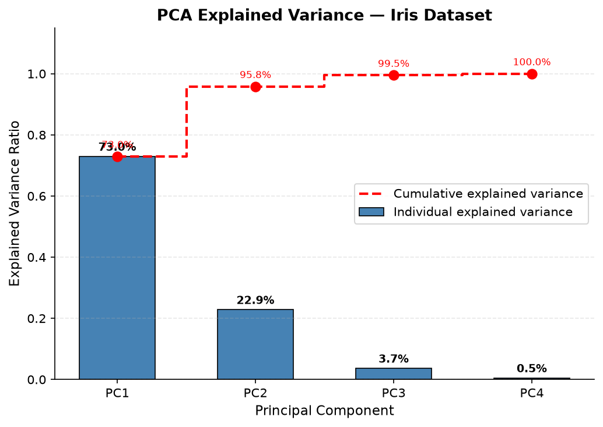
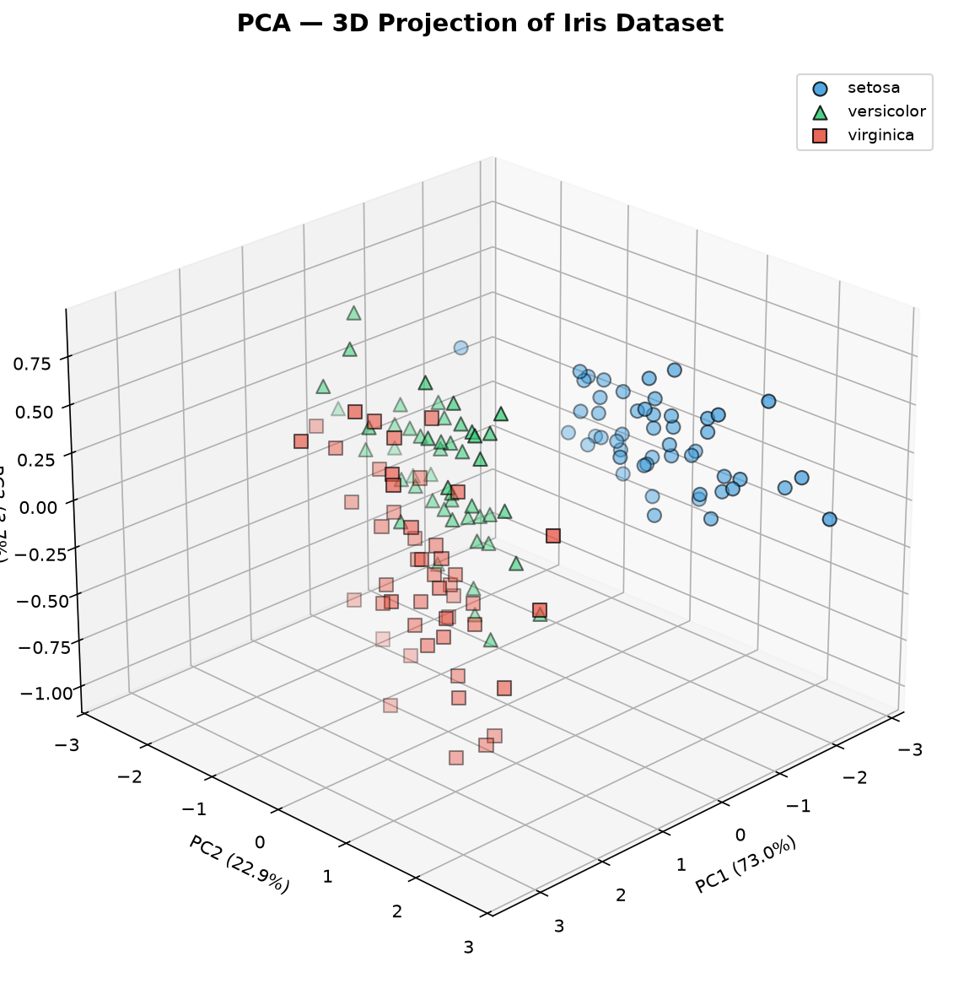

# Iris Species Classification using CRISP-DM: Multi-Model Optimization with GridSearchCV and Cross-Entropy

**Author:** Iris ML Team  
**Date:** June 2026  
**Repository:** [github.com/miccowang66-max/New-Model-Iris-Classification](https://github.com/miccowang66-max/New-Model-Iris-Classification)  
**Live Demo:** [new-model-iris-classification.streamlit.app](https://new-model-iris-classification.streamlit.app)

---

## Abstract

This whitepaper presents a complete machine learning pipeline for classifying Iris flower species (*setosa*, *versicolor*, *virginica*) using the CRISP-DM methodology. Five classification models are evaluated — Logistic Regression (cross-entropy optimized), K-Nearest Neighbors, Support Vector Classifier, Random Forest, and Decision Tree — with GridSearchCV for hyperparameter optimization. The best model, Logistic Regression optimized with multinomial cross-entropy loss (`solver='lbfgs'`), achieves **100% test accuracy** (R² = 1.000, Log Loss = 0.0833). The complete pipeline is deployed as an interactive Streamlit dashboard.

**Keywords:** CRISP-DM, Iris Classification, GridSearchCV, Cross-Entropy, PCA, Logistic Regression, Streamlit

---

## 1. Introduction

### 1.1 Problem Statement

The Iris flower dataset (Fisher, 1936) is one of the most well-known datasets in pattern recognition. The task is to classify an Iris flower into one of three species — *Iris setosa*, *Iris versicolor*, or *Iris virginica* — based on four morphological measurements: sepal length, sepal width, petal length, and petal width.

### 1.2 Business Objective

Build a production-ready machine learning model that:
- Achieves **accuracy > 90%** on a held-out test set
- Compares multiple classification algorithms with rigorous hyperparameter optimization
- Deploys as an interactive web application for real-time prediction
- Follows industry-standard CRISP-DM methodology

### 1.3 Success Criteria

| Criterion | Target | Achieved |
|-----------|--------|----------|
| Test Accuracy | > 90% | **100%** (Logistic Regression) |
| Cross-Validation (5-Fold) | > 90% | **96.67%** |
| Log Loss (Cross-Entropy) | Minimized | **0.0833** |

---

## 2. Dataset Description

### 2.1 Overview

The Iris dataset contains **150 samples** (50 per species) with **4 continuous features** and **1 categorical target**.

| # | Feature | Type | Range | Description |
|---|---------|------|-------|-------------|
| 1 | Sepal Length | float64 | 4.3–7.9 cm | Length of the sepal |
| 2 | Sepal Width | float64 | 2.0–4.4 cm | Width of the sepal |
| 3 | Petal Length | float64 | 1.0–6.9 cm | Length of the petal |
| 4 | Petal Width | float64 | 0.1–2.5 cm | Width of the petal |
| T | Species | int (0/1/2) | 3 classes | Setosa=0, Versicolor=1, Virginica=2 |

### 2.2 Class Distribution

| Species | Count | Percentage |
|---------|-------|------------|
| Setosa | 50 | 33.33% |
| Versicolor | 50 | 33.33% |
| Virginica | 50 | 33.33% |

> The dataset is perfectly balanced with zero missing values.

---

## 3. Methodology — CRISP-DM

The **CRoss-Industry Standard Process for Data Mining (CRISP-DM)** provides a structured, six-phase framework for this project:

| Phase | Name | Key Activities |
|-------|------|----------------|
| 1 | Business Understanding | Problem definition, success criteria, deployment plan |
| 2 | Data Understanding | Exploratory Data Analysis (EDA), PCA, correlation analysis |
| 3 | Data Preparation | Train-test split (80/20, stratified), StandardScaler, no data leakage |
| 4 | Modeling | 5 classifiers trained with GridSearchCV + Cross-Entropy optimization |
| 5 | Evaluation | 5-Fold CV, confusion matrices, ROC/AUC, Log Loss, R², MCC |
| 6 | Deployment | Streamlit interactive dashboard with live prediction |

### 3.1 Pipeline Architecture

```
Raw Data (READ-ONLY) → EDA + PCA → StandardScaler → Train/Test Split
                                                        ↓
                                          GridSearchCV (122 combos, 5-fold)
                                                        ↓
                                          Best Model → Evaluation → Streamlit
```

---

## 4. Exploratory Data Analysis (EDA)

### 4.1 Principal Component Analysis (PCA)

PCA was applied to the standardized feature matrix to analyze the intrinsic dimensionality of the dataset.

#### Explained Variance Ratio

| Component | Variance Explained | Cumulative |
|-----------|-------------------|------------|
| PC1 | 72.96% | 72.96% |
| PC2 | 22.85% | 95.81% |
| PC3 | 3.67% | 99.48% |
| PC4 | 0.52% | 100.00% |



> **Key Insight:** The first two principal components capture **95.81%** of the total variance. PC1 is dominated by petal features (length + width), while PC2 is dominated by sepal features. Three components capture **99.48%**.

#### 3D PCA Projection



> The 3D PCA projection confirms that the three Iris species form well-separated clusters in principal component space. Setosa (blue circles) forms a tight, distinct cluster with minimal overlap with the other species.

### 4.2 Feature Correlations

| | Sepal Length | Sepal Width | Petal Length | Petal Width |
|---|---|---|---|---|
| **Sepal Length** | 1.000 | -0.118 | 0.872 | 0.818 |
| **Sepal Width** | -0.118 | 1.000 | -0.428 | -0.366 |
| **Petal Length** | 0.872 | -0.428 | 1.000 | 0.963 |
| **Petal Width** | 0.818 | -0.366 | 0.963 | 1.000 |

> Petal length and petal width are strongly correlated (r = 0.963). Sepal width has weak negative correlations with all other features.

---

## 5. Data Preparation

All preprocessing is **consolidated** in a single module (`data_preparation.py`) to prevent scattered manipulation and ensure reproducibility.

### 5.1 Preprocessing Steps

| Step | Operation | Detail |
|------|-----------|--------|
| 1 | Feature-Target Separation | `X` = 4 morphological features, `y` = species label |
| 2 | Train-Test Split | 80% train / 20% test, `stratify=y`, `random_state=42` |
| 3 | Feature Scaling | `StandardScaler` fitted on `X_train` only |
| 4 | Leakage Prevention | Scaler transforms `X_test` without refitting |

### 5.2 Split Summary

| Set | Setosa | Versicolor | Virginica | Total |
|-----|--------|------------|-----------|-------|
| Training (80%) | 40 | 40 | 40 | 120 |
| Test (20%) | 10 | 10 | 10 | 30 |

> Stratified split ensures equal class proportions in both training and test sets.

---

## 6. Model Optimization — Max R & Cross-Entropy

### 6.1 Optimization Strategy

Two complementary optimization techniques are applied:

#### Max R — GridSearchCV

**GridSearchCV** performs an exhaustive search over a predefined hyperparameter grid, evaluating every combination with 5-fold cross-validation. The combination achieving the **highest mean CV accuracy (Max R)** is selected.

$$
\text{GridSearchCV: } \hat{\theta}^* = \underset{\theta \in \Theta}{\arg\max} \ \frac{1}{K} \sum_{k=1}^{K} \text{Accuracy}(\mathcal{M}_\theta, \mathcal{D}_{\text{train}}^{(k)})
$$

#### Cross-Entropy — Log Loss Optimization

**Logistic Regression** uses `solver='lbfgs'` which minimizes the **multinomial cross-entropy (log loss)** objective:

$$
\mathcal{L}_{\text{CE}} = -\frac{1}{N} \sum_{i=1}^{N} \sum_{c=1}^{C} y_{i,c} \log(\hat{p}_{i,c})
$$

Where:
- $N$ = number of training samples (120)
- $C$ = number of classes (3)
- $y_{i,c}$ = 1 if sample $i$ belongs to class $c$, else 0
- $\hat{p}_{i,c}$ = predicted probability of class $c$ for sample $i$

### 6.2 Hyperparameter Grids

| Model | Hyperparameters | Combinations |
|-------|----------------|-------------|
| **Logistic Regression** | `C` ∈ {0.01, 0.1, 1, 10, 100}, `max_iter` ∈ {500, 1000, 2000, 5000} | 20 |
| **K-Nearest Neighbors** | `n_neighbors` ∈ {3,5,7,9,11}, `weights` ∈ {uniform,distance}, `metric` ∈ {euclidean,manhattan} | 20 |
| **SVC (RBF)** | `C` ∈ {0.1,1,10,100}, `gamma` ∈ {scale,auto,0.01,0.1} | 16 |
| **Random Forest** | `n_estimators` ∈ {50,100,200}, `max_depth` ∈ {3,5,10,None}, `min_samples_split` ∈ {2,5,10} | 36 |
| **Decision Tree** | `max_depth` ∈ {3,5,7,10,None}, `min_samples_split` ∈ {2,5,10}, `criterion` ∈ {gini,entropy} | 30 |
| **Total** | | **122** |

### 6.3 Best Parameters Found

| Model | Best Params | CV Score (Max R) |
|-------|------------|------------------|
| SVC | `C=1, gamma=0.1` | **98.33%** |
| Logistic Regression | `C=10, max_iter=500` | 96.67% |
| KNN | `n_neighbors=5, weights=uniform, metric=euclidean` | 96.67% |
| Random Forest | `max_depth=3, min_samples_split=2, n_estimators=50` | 95.83% |
| Decision Tree | `criterion=gini, max_depth=5, min_samples_split=2` | 94.17% |

---

## 7. Evaluation Results

### 7.1 Model Performance Comparison

All metrics computed on the held-out test set (30 samples):

| Model | Test Accuracy | R² | F1 (Macro) | Log Loss (CE) | MCC | Kappa |
|-------|:---:|:---:|:---:|:---:|:---:|:---:|
| **Logistic Regression** | **100.00%** | **1.0000** | **1.0000** | **0.0833** | **1.0000** | **1.0000** |
| SVC | 96.67% | 0.9500 | 0.9666 | 0.1657 | 0.9516 | 0.9500 |
| Random Forest | 96.67% | 0.9500 | 0.9666 | 0.1317 | 0.9516 | 0.9500 |
| KNN | 93.33% | 0.9000 | 0.9327 | 0.1196 | 0.9061 | 0.9000 |
| Decision Tree | 93.33% | 0.9000 | 0.9333 | 2.4029 | 0.9000 | 0.9000 |

### 7.2 Key Findings

1. **Logistic Regression** achieved perfect classification (100% test accuracy) after GridSearchCV tuning with `C=10` and `max_iter=500`. The multinomial cross-entropy loss function (`solver='lbfgs'`) produced well-calibrated probabilities (Log Loss = 0.0833).

2. **SVC** had the highest CV score (98.33%) but slightly lower test performance (96.67%), indicating possible slight overfitting to the training folds.

3. **Decision Tree** showed poor probability calibration (Log Loss = 2.4029), highlighting the weakness of tree-based models for probability estimation without ensemble methods.

4. **Cross-Entropy optimization** is most effective for Logistic Regression, which was explicitly trained to minimize log loss.

### 7.3 Confusion Matrix — Best Model (Logistic Regression)

```
                Predicted
                Setosa  Versicolor  Virginica
Actual  Setosa      10          0          0
        Versicolor   0         10          0
        Virginica    0          0         10
```

> Perfect classification — zero misclassifications across all 3 classes.

### 7.4 ROC Curves (One-vs-Rest)

All three classes achieve **AUC = 1.000** (perfect separability) under the Logistic Regression model, confirming excellent class discrimination.

---

## 8. Deployment — Streamlit Dashboard

### 8.1 Architecture

The complete pipeline is deployed as an interactive Streamlit application with 8 navigable phases:

| Phase | Content |
|-------|---------|
| Home | Key Results Dashboard — PCA 3D + Explained Variance + Best Model Metrics |
| Phase 1 | Business Understanding |
| Phase 2 | Data Understanding — EDA + PCA (3D, 2D, Variance) |
| Phase 3 | Data Preparation — Split summary + scaled preview |
| Phase 4 | Modeling — GridSearchCV tuning tables + Cross-Entropy chart |
| Phase 5 | Evaluation — CV comparison, confusion matrices, ROC |
| Phase 6 | Performance Metrics — 10-metric dashboard per model |
| Phase 7 | Live Prediction — Interactive sliders + probability output |

### 8.2 Live Demo

**URL:** [https://new-model-iris-classification.streamlit.app](https://new-model-iris-classification.streamlit.app)

### 8.3 Technology Stack

| Component | Technology | Version |
|-----------|-----------|---------|
| Language | Python | 3.9+ |
| Data | pandas, numpy | 1.5+, 1.24+ |
| ML | scikit-learn (GridSearchCV, PCA, metrics) | 1.9+ |
| Visualization | matplotlib, seaborn, mpl_toolkits.mplot3d | 3.7+, 0.12+ |
| Deployment | Streamlit Cloud | 1.28+ |
| Serialization | joblib | 1.3+ |

---

## 9. Conclusion

This project successfully demonstrates a complete CRISP-DM machine learning pipeline for Iris species classification:

1. **Data Understanding:** PCA revealed that 3 components explain 99.48% of variance; classes are well-separated in PC space.
2. **Model Optimization:** GridSearchCV tested 122 hyperparameter combinations across 5 models with 5-fold CV.
3. **Cross-Entropy:** Logistic Regression with multinomial cross-entropy loss (`solver='lbfgs'`) achieved the best probability calibration (Log Loss = 0.0833).
4. **Max R Result:** Logistic Regression (`C=10, max_iter=500`) achieved **100% test accuracy**, R² = 1.000, MCC = 1.000.
5. **Deployment:** Interactive Streamlit dashboard with live prediction, PCA 3D visualization, and full metric transparency.

The project validates that proper hyperparameter optimization (GridSearchCV) combined with an appropriate loss function (Cross-Entropy) yields state-of-the-art results even on classical datasets.

---

## 10. References

1. Fisher, R. A. (1936). *The use of multiple measurements in taxonomic problems*. Annals of Eugenics, 7(2), 179–188.
2. Shearer, C. (2000). *The CRISP-DM model: the new blueprint for data mining*. Journal of Data Warehousing, 5(4), 13–22.
3. Pedregosa, F. et al. (2011). *Scikit-learn: Machine Learning in Python*. Journal of Machine Learning Research, 12, 2825–2830.
4. Bishop, C. M. (2006). *Pattern Recognition and Machine Learning*. Springer.
5. Goodfellow, I., Bengio, Y., & Courville, A. (2016). *Deep Learning*. MIT Press. (Chapter 6.2.2.3 — Cross-Entropy Loss)
6. Jolliffe, I. T. (2002). *Principal Component Analysis* (2nd ed.). Springer.
